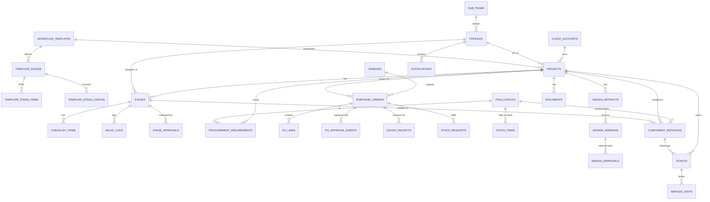

# Azimuth BuildTrack: Data Model

The **schema as it actually exists after migrations `0001`–`0025`**: 33 tables, 5 views, 19 enums.
The migrations in `supabase/migrations/` are the source of truth. This page explains them.
Callable functions (RPCs) are in [`API.md`](API.md). Who produces which data for whom is in
[`../DEPENDENCIES.md`](../DEPENDENCIES.md).

Conventions: every `id` is `uuid primary key default gen_random_uuid()`. "→ x" is a foreign key.
`(0020)` marks the migration that added a column or table. Person FKs to `profiles` are
`ON DELETE SET NULL` (from `0009`), **except** the seven added in `0020`/`0017` (see §9).

---

## 1. Entity relationships

`attachments` is polymorphic (`owner_type` + `owner_id`, no FK). `bays` exists but is unused.

---

## 2. Enums (`0001`, plus `po_approval_status` in `0020`)

| Enum | Values |
|---|---|
| `user_role` | admin, pm, procurement, workshop, store, design, service, client |
| `user_status` | active, invited, disabled |
| `project_status` | on_track, at_risk, delayed, delivered |
| `stage_status` | todo, in_progress, done, rework |
| `delay_reason` | procurement, design_approval, workshop_capacity, weather, client, quality, other |
| `req_status` | pending, ordered, received |
| `po_status` (fulfilment) | ordered, dispatched, received, partial *(partial is never produced)* |
| `po_approval_status` | pending_pm, pending_final, approved, rejected |
| `grn_status` | complete, partial, issue |
| `component_status` | in_stock, installed, replaced, faulty *(last two never set by code)* |
| `design_type` | layout, interior, exterior, branding |
| `design_status` | draft, pending_approval, revision, approved |
| `approval_status` | pending, approved, changes_requested, rejected *(stages use approved/rejected; designs use approved/changes_requested)* |
| `ticket_category` | equipment, electrical, cosmetic, other |
| `ticket_status` | open, in_progress, resolved, closed |
| `ticket_priority` | low, medium, high |
| `resolution_type` | warranty_replace, repair, remote_guide |
| `visit_status` | scheduled, done, cancelled |
| `doc_type` | contract, invoice, warranty_pack, handover_cert |

Sequences: `ticket_number_seq` gives `T-001` (`0010`). `po_number_seq` gives `PO-00001` (`0020`).

---

## 3. Tables

### People & access
| Table | Columns | Notes |
|---|---|---|
| `profiles` | id → `auth.users` (cascade), full_name, email (unique), phone, role, avatar_color, status (default `invited`), created_by, created_at, sub_team_id → sub_teams *(0021)* | One row per login, written by the `admin-create-member` Edge Function. `role` picks the home screen. |
| `client_accounts` | business_name, contact_user_id → profiles, phone, email | **contact_user_id is the client's login.** Without it the client can never see their truck. One account can own many projects. |
| `sub_teams` *(0021)* | role, name, created_at · unique(role, name) | A department's teams (seed: Workshop → Welding, Paint, Electrical, Fitter). |

### Templates & builds
| Table | Columns | Notes |
|---|---|---|
| `workflow_templates` | name, truck_type | |
| `template_stages` | template_id, name, ord, default_duration_days, depends_on *(unused)*, discipline *(0009)* | `discipline` falls back to `fn_infer_discipline(name)`. |
| `template_stage_items` *(0005)* | template_stage_id, item_catalog_id, qty | The template **BOM**. Onboarding turns it into requirements. |
| `template_stage_checks` *(0012)* | template_stage_id, label, ord | The template **checklist**. Onboarding copies it into `checklist_items`. |
| `projects` | code (unique), name, client_account_id, template_id, pm_id, pm_assigned_by, pm_assigned_at *(0009)*, status, progress_pct, current_stage_id → stages, target_delivery_date, actual_delivery_date, advance_received *(unused)*, created_at | `status`, `progress_pct` and `current_stage_id` are **computed** (§6). `actual_delivery_date` is set by `fn_mark_delivered`. |
| `stages` | project_id, template_stage_id, name, ord, discipline, planned_start/end, actual_start/end, status, assignee_id, assigned_by/at/start/due *(0009)*, bay_id *(unused)* | `planned_*` come from backward scheduling. `assigned_*` are what the PM committed to. |
| `checklist_items` | stage_id, label, done | No `ord` column, so the order is insertion order. |
| `delay_logs` | stage_id, reason_code, days_delayed, note, logged_by, created_at | Written by PM → Log a delay. |
| `stage_approvals` | stage_id, submitted_by, approver_id, status, note, decided_at, created_at *(0009)* | Partial unique index: **one pending row per stage**. `approver_id` is the build's PM at submit time. |
| `bays` | name, current_stage_id | Unused; nothing writes it. |

### Procurement
| Table | Columns | Notes |
|---|---|---|
| `vendors` | name, category, avg_lead_time_days, reliability_score, contact, gstin, address, state, email *(0020)* | `state` decides CGST+SGST vs IGST on the PO document; a blank state on either side prints a single "GST" line. `reliability_score` is 100 for every vendor added in the app (the seed has fixed values), and nothing ever recomputes it. |
| `item_catalog` | name, model, category, default_vendor_id, lead_time_days, buffer_days, serialized, unit, low_stock_threshold, is_essential *(0019)*, hsn_code, default_rate *(0020)* | `serialized` means tracked per unit (`component_instances`); otherwise bulk (`stock_items`). `is_essential` items are the only ones Store can request. |
| `procurement_requirements` | project_id, item_catalog_id, qty, needed_by_date, order_by_date, status, po_id | **Hero #1.** `order_by_date = needed_by − lead_time − buffer`. |
| `purchase_orders` | po_number, vendor_id, project_id, status, order_date, expected_date, created_by · *(0020)* approval_status, subtotal, tax_total, amount, needed_by, delivery_date, ship_to, payment_terms, notes, pm_id, submitted_by/at, pm_signed_by/at, final_signed_by/at, rejected_by/at, rejection_reason · *(0021)* priority_override | Two lifecycles: **approval** (`approval_status`) gates **fulfilment** (`status`). `expected_date` = the ETA set at dispatch. `delivery_date` = what the PO asked for. |
| `po_lines` | po_id, item_catalog_id, qty, received_qty · *(0020)* unit_price, tax_rate, hsn_code, description | `tax_rate` is the GST %. |
| `po_approval_events` *(0020)* | po_id, event, from_status, to_status, actor_id, note, created_at | Immutable signature trail. Events: created, pm_signed, final_signed, rejected, resubmitted. |
| `company_settings` *(0020)* | only_one (unique), name, address, gstin, state, phone, email, logo_url, updated_at | One row. This is the buyer block on every PO. `logo_url` is never rendered. |
| `goods_receipts` | po_id, received_by, received_at, status, note | Written by `fn_receive_po`. |
| `stock_requests` *(0017)* | item_catalog_id, qty (> 0), note, status, requested_by, po_id, created_at | Store raises an essentials reorder; Procurement fills it with a general PO. |

### Inventory & traceability
| Table | Columns | Notes |
|---|---|---|
| `component_instances` | item_catalog_id, serial_number (unique), vendor_id, grn_id *(never set)*, bill_url, warranty_start/end, status, installed_in_project_id, installed_stage_id, installed_by, install_date | **Hero #2, the digital twin.** Store logs it; Workshop installs it (`fn_install_component`). |
| `stock_items` | item_catalog_id, quantity, unit | Bulk on-hand. **No unique index per item.** |

### Design
| Table | Columns | Notes |
|---|---|---|
| `design_artifacts` | project_id, type, status, current_version_id, created_by, client_feedback *(0007)* | |
| `design_versions` | artifact_id, version_no, file_url (preview image), model_url (`.glb`, *0007*), change_note, created_at | **unique(artifact_id, version_no)** *(0025)*. New versions go through `fn_add_design_version`. |
| `design_approvals` | version_id, client_user_id, status, feedback, decided_at | Written by `fn_client_decide_design`. |

### After-sales
| Table | Columns | Notes |
|---|---|---|
| `tickets` | ticket_number, project_id, raised_by, category, description, linked_component_id, priority, sla_due, status, assigned_to, resolution_type, resolution_note, created_at, resolved_at, closed_at, first_reply_at *(0010)* | Triggers fill the number, SLA and `raised_by`. No UI sets `linked_component_id`. |
| `service_visits` | ticket_id, technician_id, scheduled_date, status, note, created_at, created_by *(0010)* | One live `scheduled` visit per ticket (re-booking cancels the old one). |

### Cross-cutting
| Table | Columns | Notes |
|---|---|---|
| `attachments` | owner_type, owner_id, file_url, caption, uploaded_by, created_at | `owner_type` used: `stage` (site photos), `ticket` (client photos). |
| `documents` | project_id, type, file_url, available | The app always inserts `available = true`. |
| `notifications` | user_id, type, title, body, entity_type, entity_id, read, created_at | Written only by `fn_notify*` / triggers. |
| `audit_log` | actor_id, action, entity_type, entity_id, created_at | Written by `fn_audit`; admin-read. |

---

## 4. Views (all `security_invoker = on`, so the reader's RLS applies)

| View | Returns | Used by |
|---|---|---|
| `v_order_due` *(0003)* | pending requirements + `item_name`, `project_code`, `days_left`, ordered by order-by | Admin "needs attention", Procurement To Order |
| `v_po_pending_approvals` *(0021)* | POs in `pending_pm` / `pending_final` + vendor, project, `waiting_since`, `waiting_hours`, `overdue`, `priority`, `priority_rank` | PO Approvals inbox (PM + Admin) |
| `v_ops_board` *(0021)* | one row per non-delivered build: status, progress, PM, current stage + discipline + status, `days_in_stage`, `stage_due`, assignee + role + sub-team, `next_order_by` | Admin Command Center ("stuck" = `days_in_stage > 7`, computed in the app) |
| `v_project_delays` *(0022)* | each `delay_log` + stage, discipline, `logged_by_name`, `assignee_name` | Build → Pipeline delay ledger |
| `v_truck_components` *(0023)* | every installed part of a build + item, model, vendor, bill, warranty, stage, installer | Build → Record (truck record) |

---

## 5. Triggers

| Trigger | On | Does |
|---|---|---|
| `t_stage_progress` | stages, after insert / update **of status** / delete | Recomputes progress, then current stage, then status |
| `t_guard_projects` | projects, before update | A non-admin can't change `pm_id` (except to null), `code`, `client_account_id` or `template_id` |
| `t_guard_stages` | stages, before update | Only admin or the build's PM may change `assignee_id`, `discipline`, `ord`, `project_id`, `bay_id`, `planned_*` or `assigned_*` (*not* `status`; see §9) |
| `trg_po_require_approval` | purchase_orders, before update | Refuses dispatched / partial / received unless `approval_status = 'approved'` |
| `t_ticket_defaults` | tickets, before insert | Fills `ticket_number` (`T-###`), `sla_due` (high 4h · medium 24h · low 72h) and `raised_by` |
| `t_ticket_created` | tickets, after insert | Notifies every service and admin user |

---

## 6. Engine logic

- **Backward schedule** (`fn_recompute_schedule`): starting from `target_delivery_date`, it walks stages from the
  last `ord` to the first. Each stage ends where the next one starts and lasts `default_duration_days`
  (min 1; calendar days, no holidays). Then every requirement gets
  `order_by = needed_by − lead_time_days − buffer_days`. With `p_rebaseline_assigned = true` (only the
  delivery-date change uses it), it also snaps open stages' `assigned_start` / `assigned_due` to the new plan.
  `needed_by` is set once at onboarding, to the stage's `planned_start`, and is not re-derived.
- **Progress** = `round(100 × done / total)`.
- **Current stage**: the first in_progress / rework stage, else the first todo, else the last stage.
- **Status** (`fn_recompute_status`, `0024`); the first rule that matches wins:
  1. `actual_delivery_date` is set → **delivered**
  2. the target date is past, **or** any open stage's `planned_end` is past → **delayed**
  3. a todo stage's `planned_start` is today or earlier, **or** a pending requirement's order-by date is today or earlier, **or** delivery is ≤ 7 days away with work open → **at_risk**
  4. otherwise → **on_track**

  It runs on stage status changes and from `fn_refresh_all_statuses()`. The dashboards call the latter on load,
  and a daily cron is recommended.
- **PO priority** (`v_po_pending_approvals`): `priority_override` if set. Otherwise from `needed_by`:
  past → critical, ≤ 3 days → high, ≤ 7 days → medium, later → low, no date → medium.
- **PO totals** (`fn_create_po` / `fn_resubmit_po`): subtotal = Σ qty × rate; tax = Σ qty × rate × GST% / 100;
  amount = subtotal + tax.

---

## 7. Storage (both buckets public-read)

| Bucket | Path | Written by |
|---|---|---|
| `designs` *(0008)* | `<uid>/<ms>_<file>` | Design: `.glb` models + preview images |
| `builds` *(0011)* | `stages/<stageId>/` | Workshop site photos |
| | `tickets/<ticketId>/` | Client ticket photos (the only path a client may write) |
| | `bills/` | Store bill images |
| | `docs/<projectId>/` | Build documents (contract, invoice, …) |

Staff may write anywhere in both buckets.

---

## 8. Who can read / write what (RLS after `0025`)

R = read all rows · W = insert/update/delete · **own** = scoped as noted · — = no access.
Workflow writes (assign, start, submit, approve, onboard, PO chain, tickets, recall) go through
`SECURITY DEFINER` RPCs with their own role checks. See [`API.md`](API.md).

| Table(s) | admin | pm | procurement | store | workshop | design | service | client |
|---|---|---|---|---|---|---|---|---|
| profiles | RW | R | R | R | R | R | R | own row |
| client_accounts | RW | R | R | R | R | R | R | own |
| templates, template_stages, \_items, \_checks | RW | RW | R | R | R | R | R | — |
| projects | RW | R + update own | R | R | R | R | R | own |
| stages | RW | R + W own builds | R | R + update if assignee | (same) | (same) | (same) | own builds |
| checklist_items | RW | R + W own builds | R | R + W if assignee | (same) | (same) | (same) | own builds |
| delay_logs | RW | RW | R | R | RW | R | R | — |
| stage_approvals | RW | RW | R | R | R | R | R | — |
| vendors | RW | R | RW | R | R | R | R | — |
| item_catalog | RW | RW | RW | **R** | R | R | R | — |
| procurement_requirements | RW | RW | R + update | R | R | R | R | — |
| purchase_orders | R + update | R | R + update | R | — | — | — | — |
| po_lines | RW | R | RW | R | — | — | — | — |
| po_approval_events | R | R | R | R | — | — | — | — |
| company_settings | RW | R | R | R | R | R | R | — |
| goods_receipts | RW | R | RW | RW | R | R | R | — |
| stock_requests | RW | R | R + update | R + insert | — | — | — | — |
| stock_items, component_instances | RW | R | R | RW | R | R | R | — |
| design_artifacts, design_versions | RW | R | R | R | R | RW | R | own builds |
| design_approvals | RW | R | R | R | R | RW | R | own rows |
| tickets | RW | R | R | R | R | R | RW | own + own builds; insert |
| service_visits | RW | R | R | R | R | R | RW | own tickets |
| attachments, documents | RW | RW | RW | RW | RW | RW | RW | stage photos + available docs of own builds; own ticket photos (+ insert) |
| notifications | own | own | own | own | own | own | own | own |
| sub_teams | RW | R | R | R | R | R | R | — |
| audit_log | R | — | — | — | — | — | — | — |

Nobody can INSERT or DELETE `purchase_orders` directly; `fn_create_po` is the only way in.
Views inherit these rules.

---

## 9. Known schema issues (open, Oct 2026)

Listed with fixes in [`WORKFLOW_AUDIT.md`](WORKFLOW_AUDIT.md) §7:

- `t_guard_stages` / `t_guard_projects` leave `status` and the delivery dates unguarded.
- Procurement can set `approval_status` itself.
- Seven person FKs added in `0017` / `0020` have no `ON DELETE`, so removing such a member fails:
  `purchase_orders.{pm_id, submitted_by, pm_signed_by, final_signed_by, rejected_by}`,
  `po_approval_events.actor_id`, `stock_requests.requested_by`.
- `stock_items` has no unique index per item.
- `p_tickets_client_new` and `p_dappr_client` are too broad.
- Disabled accounts keep access.
